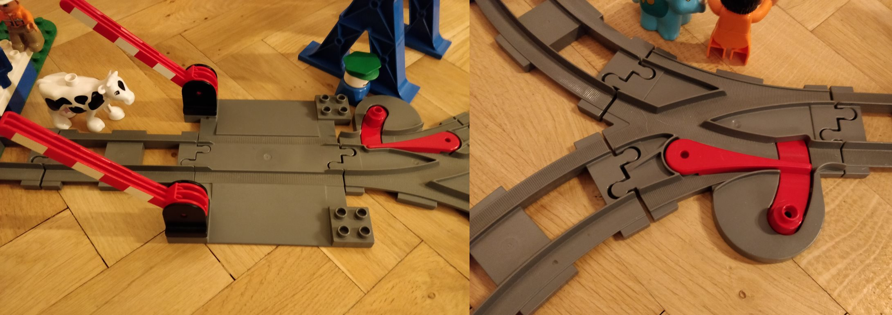
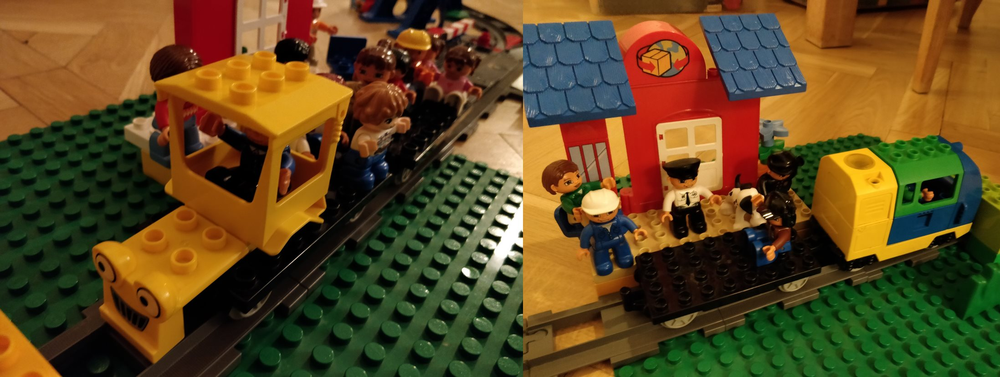

# Project 2 - The train schedule simulator

For the procedures used in this project see : [Procedures](Procedures.md)

For the documentation by the team see: [Documentation/readme.md](Documentation/readme.md)

# The train schedule simulator

The goal of this project is to create a small train simulator (see suggested [Getting started](#Getting-started) in the bottom) for the fictive company *DigiTrain*.

At the control tower works DigiTrain mr Carlos, his job is to make new time schedules for the trains on the track. Mr Carlos knows a bit of programming and have a wish to be able to describe the schedule using a fluent API, and he wants to be able to test if the schedule makes sense.

> **Your assignment**
>
> Develop a fluent API in C# which can be used to describe the schedule of a train track. It should be possible to save and load the output of the fluent API.
>
> Make it possible to simulate the schedule generated with the API against the train track, to see if it is possible to to follow the schedule.


The full track consist if four stations (but it should be possible to simulate a smaler track), two end-stations and two in-between, on separate tracks. The trains needs to follow the schedule (on when to leave the station). The full track also consist of other elements which might need to be part of the full schedule, the elements are level crossings (the trains can't parse an open crossing thanks to the [ETCS system](https://en.wikipedia.org/wiki/European_Train_Control_System)) and the railroad switches (advanced). 



The track have currently two active trains going back and forward Golden Arrow and Lapplandståget, it has previously been operated by other trains, but these are no longer in service. Each train have a max speed, and we can assume that this train always goes by this speed.



Each train have a wagon with passengers, and these gets on and of at different stations, so the train needs to stop for 2 minutes at each station.

There can only be one train at each station at the time. If there is currently not room for the train must it wait until the other train has left.

## Your assignment

The project is parted into three parts, and the suggestion is to implement the project in the suggested order. Remember to create unit tests, where possible throughout the project.

Make sure to start simple, and then extend the program.

### Part 1 - A fluent API to plan the trains

>  **The goal of Part 1**
>
> To create a Fluent API which can be used to set up a schedule for all parts of the train track. When the train starts and stops, from and to where the trains go. And later on, control the position of crossings and switches. The API should return an instance of a schedule model.

Produce a fluent API used by mr Carlos to manually plan the trains, it could maybe look something like this:

```C#
Train train1 = new Train("Name of train");
Station station1 = new Station("Gothenburg");
Station station2 = new Station("Stockholm");

ITravelPlan travelPlan = new TrainPlaner(train1, station1)
        .HeadTowards(station2)
        .StartTrainAt("10:23")
        .StopTrainAt(station2, "14:53")
    .GeneratePlan();
```

### Part 2 - Develop an ORM for reading the data

> **The goal of Part 2**
>
> Create class which works as an ORM for each of the provided file type, and model for each type.  The ORM should be able to read the file, and return an instance of the belonging model. An ORM should also be created which can handle (load and save) the plan/schedule model.

Create your own mini ORM for the data provided. 

It should also be possible to save and load a schedule made using the Fluent API. You can choose to implement this in the data format you prefer (eg json)

```csharp
travelPlan.Save("Data/travelplan-train1.txt"); //json, yaml, bin, csv
travelPlan.Load("Data/travelplan-train1.txt"); //json, yaml, bin, csv
```

### Part 3 - Simulate the schedule

> **The goal of Part 3**
>
> Implement functionality to simulate the schedule using a minimum of one thread. Give the user a notion of one or more trains running on the track and that how it tries to follow the given schedule.

It should be possible to start the trains on the track, a bit like this:

```c#
// example Solution1
Train train1 = new Train1();
train1.Start(travelplan1);
train1.Stop(); // maybe not need

// example Solution2
travelplan1.Train.Start()
travelplan1.Train.Stop(); // maybe not needed

// example Solution3
ITravelPlan travelplan = TravelPlan.Load("file.travelplan");
travelplan.Simulate(fakeClock);
```

The initial though is that each train should have it's own thread running without the knowledge of other trains in the track. But aware of signals on the track. The train is automatically stopping at all stations but should leave the station at the time given. 

Some notion of length is needed, assume eg. that each track ( `-` )  in the trackfile is eg 10 km. You will need to calculate if the train makes it to the station in time, otherwise will the schedule made by mr Carlos be useless (and we want to know that before putting the schedule in production).

## Given

Some files are given in this repository.

**Data**

This folder contains five files (three different):

* Stations (*stations.txt*): All trains stations on the track, 
  * Read only (you need to implement writing of this file into the ORM)
  * columns separated by '|'
  
* Trains (*trains.txt*): contains a list of trains, some trains are not active
  * Read only (you need to implement writing of this file into the ORM)
  * columns separated by ','
  
* Train track, there is three versions of this file

  * Read only (you need to implement writing of this file into the ORM)

  * Elements in the file

    * The stations placement with ID eg: `[1]`, `[2]`
    * The start station: `*`
    * Tracks: `-`, `/` and `\`

  * *traintrack1.txt*: Describes an absolute basic track consisting of just two stations

  * *traintrack2.txt*: A track with three stations and a level crossing.

    - Introduces Level crossing: `=`

  * *traintrack3.txt*: An advanced track with two parallel tracks. 

    - Tracks, introduces:  `/` and `\`
    - Railroad switches: `<` and `>`

      

**Documentation**

The folder initially only contains one file called *readme.md*, this file is more or less empty.

In this folder should you place digital representations of all documentation you do. Screenshots, photos (of CRC cards, mindmaps, diagrams).

Please make a link and descriptive text in the *readme.md* using the markdown notation:

```markdown
# Our train project
What we have done can be explained by this mindmap.

Bla bla bla bla
```

**Source**

The source folder contains a solution with three projects. With a small code outline.

* TrainEngine, .NET Standard 2.1, This project should contain all the logic of you program
* TrainConsole, NET 5, This project is what starts when you start the project, is a console application
* TrainEngine.Tests, .NET 5, This project should contain all of your automated tests

# Getting started

This is some **suggestions** on how you can get started on this project:
1. Discuss how to get started and describe you agreements in *readme.md* file in the `Documentation` folder
2. Start be creating a **very basic** fluent API which can create a TravelPlan, eg: `new TravelPlan().StartAt("station1", "10:30").ArriveAt("station2","12:30").GeneratePlan()`
   * Remember unit tests
3. Create ORM for **reading** the three files:
   * stations.txt
   * trains.txt
   * traintrack1.txt
   * Remember unit tests
4. Implement possibility to read and save the TravelPlan
5. Extend the ORM for the train track so it can handle *traintrack2.txt*
   * Remember unit tests
6. If needed extend the fluent API so that it eg:
   * Takes a train track as input
   * Takes one or more trains as input
   * Takes can control the level crossing (to open or close)
   * Remember unit tests
7. If needed implement a fake time, so that the simulation will not run for hours, it could be a class called `Clock`
8. Implement a thread on one train or on the TravelPlan, so that the simulation of the TravelPlan following the time table can be simulated
9. Start the simulator and see that everything works (with one train)
10. Go to **advanced** level: 
    * Extend the ORM to support *traintrack3.txt*
    * Make sure the TravelPlan handles railroad switches
    * Start the simulator and see that everything works (first with one train, then with two), and that the trains don't crash into each other :)